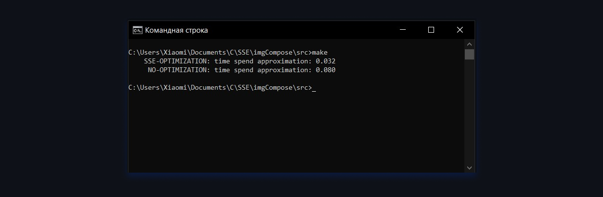

## Compose pictures

In this work, I combine two pictures into one. I get the image
by overlaying a semi-transparent image on a static background.

 

## Profit

I compared the execution speed of a regular function and an
analog on SSE in my [benchmark](src/benchmark.cpp) and got a
significant increase. clock error is about 0.01 seconds and
the gain turned out to be about 2.5

 