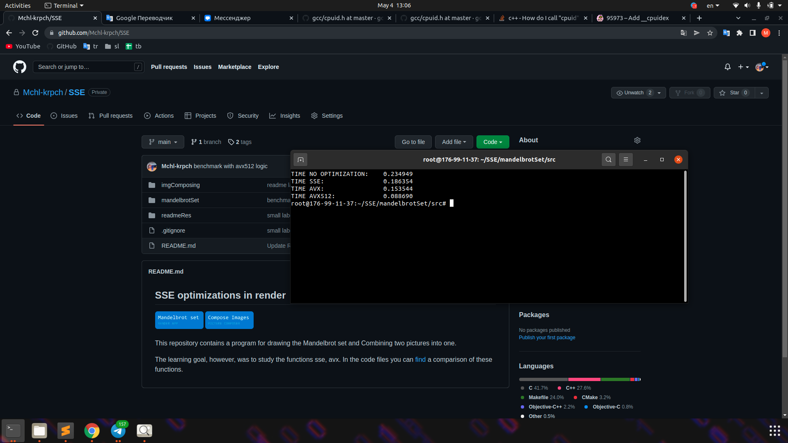
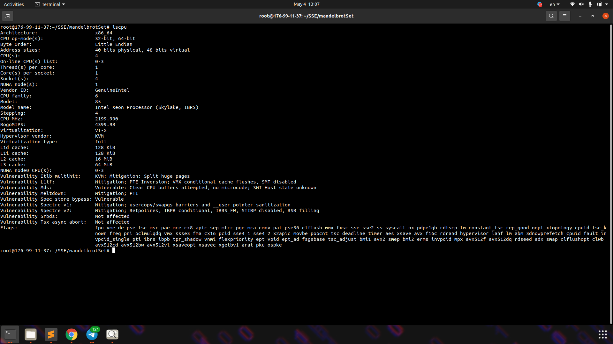

## Set drawing

If you want to run the application, download the archive or
go to the RELEASES section on github. 

This is a small application that renders the mandelbrot set. You can find similar
app [google search](https://www.google.com/search?q=mandelbrot+set) 

This application supports 4 types of rendering:
- No optimization
- sse optimization
- avx256 optimization
- avx512 [optional because your computer may not support this technology] optimization

## Navigation
- Use 'T' to change rendering mode
- Use mouse wheel to zoom and scrool Mandelbrot set
- Press 'Up arrow' and 'Down arrow' to change level of detail 

## Benchmark results

As we expected... 
AVX512 turned out to be lightning fast.

In order to test the results of AVX512, a server was rented FOR A WHOLE 0.065$ [04.05.2022]!
thanks to this machine, it was possible to fix an increase of as much as
2 times compared to AVX256.

